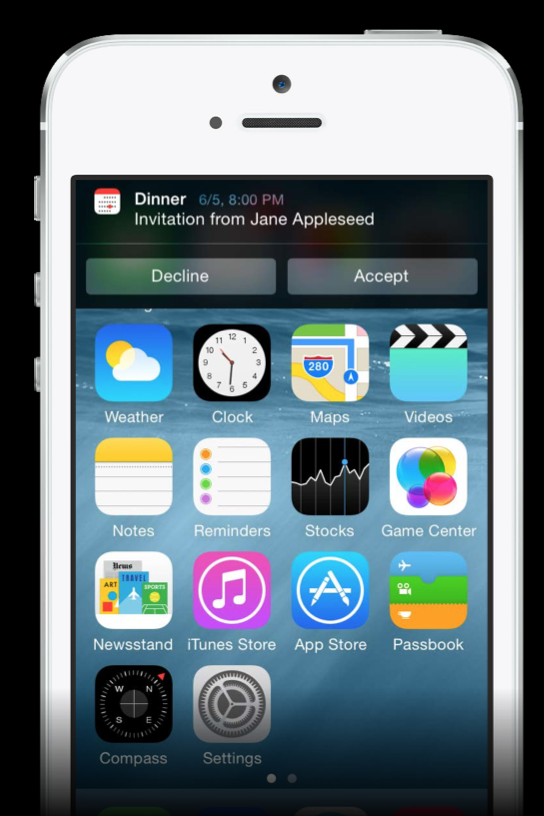

# What’s New in iOS Notifications

WWDC 2014のVideo Sessionを見てみる。
https://developer.apple.com/videos/wwdc/2014/

## User Notification iOS7の説明

### User Notificationsとは
- Alert表示
- Notification Centerに通知
- スクリーンOFFの時に表示

### User Notificationの実行
- アプリからLocal Notificationを使う
- APNsからRemote Notificationを使う
- APNsからcontent-available: 1を指定してappを介して通信する

## User Notifications iOS8

今回紹介するのは大きく以下の4つ

- User Notifications
- Notification Actions
- Remote Notification
- Location Notification

## User Notifications

### 登録方法

UIRemoteNotificationTypeと同じようなイメージ

categoryという概念が追加されているが後ほど

    UIUserNotificationType types = UIUserNotificationTypeBadge |
      UIUserNotificationTypeSound | UIUserNotificationTypeAlert;

    UIUserNotificationSettings *mySettings = [UIUserNotificationSettings
      settingsForTypes:types categories:nil];
    [[UIApplication sharedApplication] registerUserNotificationSettings:mySettings];

### ユーザパーミッション

UIApplicationDelegateにCallbackメソッドがある

許可しない場合は、allowedTypes == UIUserNotificationTypeNoneとなる

     - (void)application:(UIApplication *)application
         didRegisterUserNotificationSettings:
        (UIUserNotificationSettings *)notificationSettings {

        // user has allowed receiving user notifications of the following types
        UIUserNotificationType allowedTypes = [notificationSettings types];
    }

### 許可されたタイプの取得

    - (void)getReadyForNotification {
      // ...
      // check to make sure we still need to show notification
      UIUserNotificationSettings *currentSettings = [[UIApplication
       sharedApplication] currentUserNotificationSettings];
      [self checkSettings:currentSettings];
    }

## Notification Action

iOS7ではそれぞれのNotificationに対して、スワイプで削除、タップで起動しかできなかった

iOS8ではスワイプして、複数のボタンを準備してアクションさせる事が可能

### Actionの作成方法

ボタンのタイトルやバックグランド、ロック解除前でも可能かどうかを定義する

    UIMutableUserNotificationAction *acceptAction =
      [[UIMutableUserNotificationAction alloc] init];

    acceptAction.identifier = @"ACCEPT_IDENTIFIER";

    acceptAction.title = @"Accept";

    // Given seconds, not minutes, to run in the background
    // UIUserNotificationActivationModeForegroundを指定すると、選択時にアプリを起動する
    acceptAction.activationMode = UIUserNotificationActivationModeBackground;

    acceptAction.destructive = NO;

    // If YES requires passcode, but does not unlock the device
    acceptAction.authenticationRequired = NO;

### Categoryの作成方法

複数のアクションを登録したカテゴリを作成する

例えば：
 - メールカテゴリだと、返信アクション、アーカイブアクションなど登録
 - 友達申請用のカテゴリだと、承認アクション、保留アクションなど登録

    UIMutableUserNotificationCategory *inviteCategory =
      [[UIMutableUserNotificationCategory alloc] init];

    inviteCategory.identifier = @"INVITE_CATEGORY";

    [inviteCategory setActions:@[acceptAction, maybeAction, declineAction]
      forContext:UIUserNotificationActionContextDefault];

UIUserNotificationActionContextDefault ボタンのサイズが普通
UIUserNotificationActionContextMinimal ボタンのサイズが若干小さめ

### 定義したUserNotificationの登録

UIApplicationにActionを登録したCategoryを設定したSettingを登録する

    NSSet *categories = [NSSet setWithObjects:inviteCategory, alarmCategory, ...

    UIUserNotificationSettings *settings =
      [UIUserNotificationSettings settingsForTypes:types categories:categories];

    [[UIApplication sharedApplication]
      registerUserNotificationSettings:settings];

### カテゴリを指定したNotificationの発行

#### Remote Notification

apsにcategoryを追加して飛ばす

    {
      "aps" : {
        "alert" : "You’re invited!",
        "category" : "INVITE_CATEGORY",
      }
    }

#### Local Notification

    UILocalNotification *notification = [[UILocalNotification alloc] init];

    ...
    notification.category = @"INVITE_CATEGORY";

    [[UIApplication sharedApplication] scheduleLocalNotification:notification];

## Handling Notification Action

iOS7ではアプリが起動して無い場合

    application:didFinishLaunchingWithOptions:
    application:didReceiveRemoteNotification:fetchCompletionHandler:

アプリが起動している場合は

    application:didReceiveLocalNotification:
    application:didReceiveRemoteNotification:
    application:didReceiveRemoteNotification:fetchCompletionHandler:

iOS8では

    // Push Notificationの場合
    - (void)application:(UIApplication *)application
      handleActionWithIdentifier:(NSString *)identifier
         forRemoteNotification:(NSDictionary *)notification
             completionHandler:(void (^)())completionHandler {
        if ([identifier isEqualToString:@"ACCEPT_IDENTIFIER"]) {
          [self handleAcceptActionWithNotification:notification];
        }
        // Must be called when finished
        completionHandler();
    }

    // Local Notificationの場合
    - (void)application:(UIApplication *)application
       handleActionWithIdentifier:(NSString *)identifier
      forLocalNotification:(UILocalNotification *)notification
       completionHandler:(void(^)())completionHandler {

    }

を使う。identifireにActionで選択されたIDが入ってくる。

# Remote Notifications

User

- Requires call to registerUserNotificationSettings:

Silent

- Info.plist UIBackgroundModes array contains remote-notification

## 登録方法  

×[myApp registerForRemoteNotificationTypes:someTypes];
[myApp registerForRemoteNotifications];
[myApp registerUserNotificationSettings:mySettings];

# Location Notifications

一定エリアに入ったタイミング、出るタイミング

一定エリアに入ったら毎回通知するか、一回だけ通知するか選択可能

以前もあったけどシンプルに実装できるようになったイメージ

## 使い方

    UILocalNotification * locNotification;

    locNotification.regionTriggersOnce = YES;

    locNotification.region = [[CLCircularRegion alloc] initWithCenter:LOC_COORDINATE
    [[UIApplication sharedApplication] scheduleLocalNotification:localNotification];
